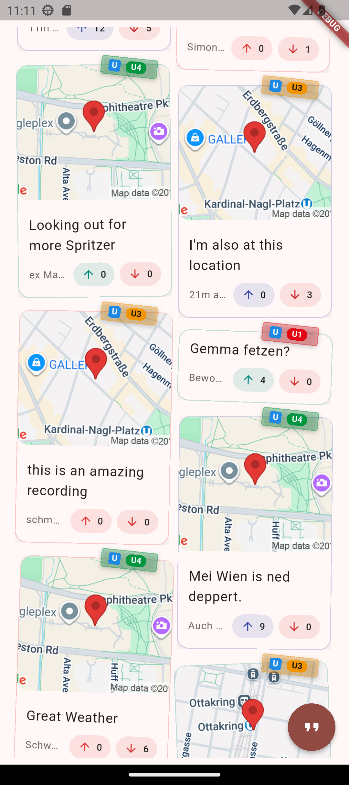
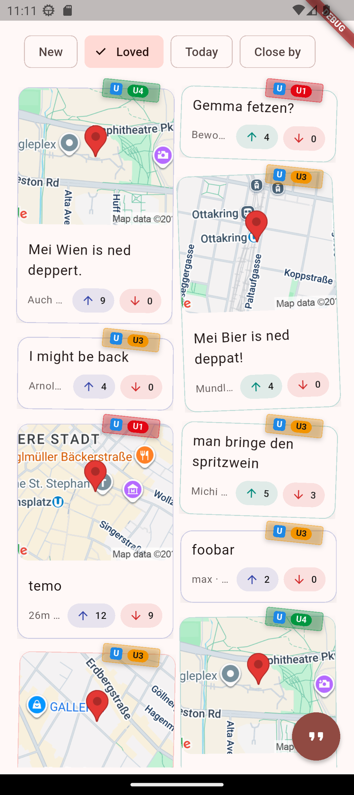
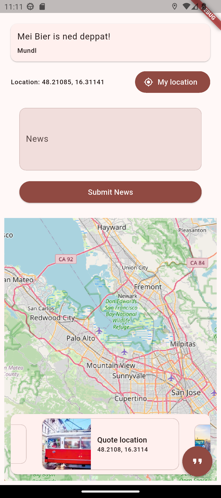
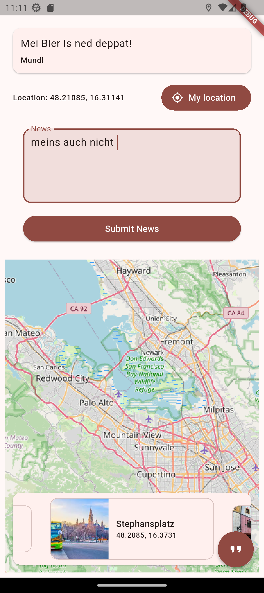

# Wien Talks

**An app developed during the [2nd Flutter Vienna Hackathon](https://www.meetup.com/fluttervienna/events/310014357/).**

## Team

_Grätzel-Goblins_ — Timo, Max & Mike

## Description

*Wien Talks* is an app to share the iconic and quotable lines you hear Viennese
people drop throughout their day. It doesn't matter if it's a U6 train
conductor's insults that he made during an announcement or the Spar cashier's
funny retort to "Zweite Kassa bitte!", *Wien Talks* is made to record, preserve
and share Viennese quotes with others.

Quotes are community-moderated—users can up- or down-vote posts. Additionally,
when creating a new quote, the location from which the user made it is added,
too. This allows you to see what's going on near you.

   
